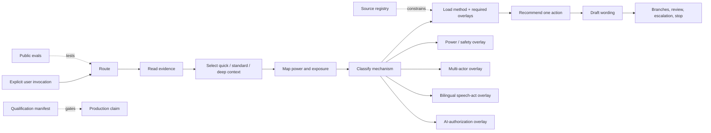

# Interpersonal Strategist

[](https://github.com/haitaowu12/interpersonal-strategist/actions/workflows/ci.yml)
[](LICENSE)
[](CHANGELOG.md)

`interpersonal-strategist` is a portable Agent Skill for workplace and
non-romantic everyday interpersonal decisions. It helps a user distinguish
evidence from interpretation, map power and decision structure, compare
plausible readings, choose a proportionate next move, and prepare wording with
response branches and stopping rules.

Current release: **`0.9.0-rc.1`**

> `0.9.0-rc.1` is a production-qualification candidate, not a production claim.
> The runtime, evidence governance, public evaluation program, and release
> controls are implemented. Independent holdouts, calibrated behavioral
> comparison, fluent bilingual review, clean-host validation, and a controlled
> pilot remain required gates in `release/qualification.json`.

## Product boundary

The skill supports:

- managing up and down;
- workload, scope, priority, capacity, and refusal;
- credit, visibility, sponsorship, exclusion, and invisible work;
- feedback, accountability, conflict containment, and trust repair;
- negotiation, authority, ratification, commitments, and follow-through;
- boundaries, documentation, qualified escalation preparation, and exit;
- ambiguous digital and AI-mediated communication;
- multi-actor decisions with distributed information and authority;
- adaptive quick, standard, and bounded deep-context interaction;
- optional governed case memory using a host adapter or portable card;
- non-romantic friend, family, roommate, neighbor, and networking situations;
- English, Simplified Chinese, and mixed-language workplace communication.

It does **not** provide:

- romance, dating, intimacy, breakup, or sexual-consent strategy;
- psychological diagnosis, personality typing, or social scoring;
- coercion, deception, retaliation, surveillance, humiliation, impersonation,
  evidence manipulation, or pressure after refusal;
- substantive legal, HR, medical, clinical, safeguarding, crisis, or emergency
  determinations;
- automatic sending, uncontrolled connectors, or personality, vulnerability,
  influence, loyalty, pressure-point, or social-status dossiers.

Invocation is explicit-only: `$interpersonal-strategist`.

## Runtime architecture

The repository separates the distributable runtime from development research,
evaluation, and release evidence.



### Distributable layer

`skill/interpersonal-strategist/` contains the complete instruction-only skill:

- `SKILL.md` — routing, bounded decision loop, overlays, output contract, and
  safety invariants;
- `agents/openai.yaml` — display metadata and explicit-only policy;
- `references/` — sixteen progressively loaded knowledge modules;
- `LICENSE` and `NOTICE.md` — redistribution terms and release boundary.

The package declares no runtime scripts, network dependency, connector, API
key, or bundled database. Optional continuity uses only a host-provided memory
adapter under the memory contract, with a portable card fallback.

### Decision loop

1. **Route** — `IN_SCOPE`, `COACH_WITH_CAUTION`, `REFER_OR_ESCALATE`, or
   `REFUSE`.
2. **Read** — separate records, observations, reports, interpretations,
   contradictions, unknowns, and stale facts.
3. **Map** — identify decision rights, dependencies, downside bearer,
   protection, audience, reversibility, and exposure.
4. **Classify** — distinguish information, coordination, authority, resource,
   process, status, trust, relationship-norm, digital, multilingual, structural,
   and safety mechanisms.
5. **Widen** — compare evidence-linked hypotheses and the observations that
   would change them.
6. **Act** — select the smallest useful move that remains sound if motive is
   uncertain.
7. **Update** — prepare plausible branches, an observation window, an
   escalation or reliance trigger, and a stop.

### Production-readiness mechanisms

`0.9.0-rc.1` adds or hardens:

- **adaptive conversation depth** with automatic readiness checks, explicit
  “grill me,” user-controlled quick mode, bounded rounds, and stop controls;
- **governed continuity memory** with scoped consent, minimal case cards,
  stale-fact verification, inspect/correct/forget controls, and no hidden
  personality or vulnerability profiling;
- **Forum-Authority-Information-Constituency-Ratification** for multi-actor
  decisions and hidden information;
- a **relationship-norm gate** separating communal care, shared arrangements,
  professional exchange, voluntary social connection, and disputed norms;
- a **feedback-exposure check** for target knowledge, candor, image cost,
  retaliation exposure, and feedback-seeking method;
- **minimum-safe reliance** choices: no reliance, minimum access, dual control,
  reversible trial, or normal reliance after evidence;
- **speech-act adaptation** for requests, refusals, disagreement, correction,
  feedback, apology, escalation, reminders, and invitations;
- an **AI authorization gate** for data permission, minimization,
  representational authority, truth, force, disclosure, and human ownership;
- prediction cards and structured debriefs that separate decision quality from
  outcome quality and prohibit covert interpersonal tests.

## Progressive disclosure

The kernel normally loads one method and one matching playbook. It adds only the
overlays made mandatory by power, safety, multilingual force, AI mediation, or
multi-actor structure.

The reference layer includes:

- evidence readiness and situation classification;
- power, voice, fair process, and multi-actor decisions;
- conflict containment and trust-reliance decisions;
- negotiation, authority, ratification, and commitments;
- relationship norms, reciprocity, and repeated helping;
- communication, feedback exposure, channel, and control rules;
- digital pragmatics and AI-mediated authorization;
- bilingual speech-act adaptation;
- practice and outcome-independent learning;
- deep-context elicitation, situational models, memory, and continuity;
- twenty end-to-end scene playbooks;
- safety, privacy, referral, and the evidence ledger.

The flat reference structure keeps discovery predictable and the portable skill
auditable.

## Evidence governance

Research constrains general mechanisms and contraindications. It does not prove
a specific person's motive or guarantee an intervention result.

- `provenance/evidence-sources.json` is the machine-readable release source of
  truth.
- `references/evidence-ledger.md` is the distributable runtime projection.
- Each promoted source records stable identity, evidence type, precise permitted
  claim, limitation, runtime rule, verification date, and licensing note.
- Validation requires registry-ledger ID, first-author or issuer, and stable-
  identity parity.
- Online DOI, PMID, and official-document resolution remains a separate release
  qualification gate.
- Branded practitioner frameworks are quarantined as optional mnemonics and are
  not represented as causal scientific authorities.
- Cultural averages are context variables, never individual predictions.

The repository redistributes original skill content and summaries, not source
papers, proprietary course text, or branded framework prose.

## Installation

### Supported Skills interface

In supported ChatGPT environments, open **Plugins**, select the **Skills** tab,
choose **Create**, then **Upload from your computer**, and upload the generated
release ZIP. Skills follow the Agent Skills open standard and may also be
available through Codex or workspace plugins. Availability and installation can
depend on plan, workspace settings, role, surface, and admin policy.

Official guidance:
[Skills in ChatGPT](https://help.openai.com/en/articles/20001066-skills-in-chatgpt/).
Review the source and contents before installation; platform scanning does not
replace organizational review or the qualification record in this repository.

### Local development installation

When the specific Codex host supports local Agent Skills discovery, copy the
skill directory into its documented skills location. A commonly supported
developer layout is:

```bash
mkdir -p "$HOME/.agents/skills"
cp -R skill/interpersonal-strategist "$HOME/.agents/skills/"
```

Repository-scoped layout where supported:

```bash
mkdir -p .agents/skills
cp -R /path/to/interpersonal-strategist/skill/interpersonal-strategist \
  .agents/skills/
```

Host discovery behavior is version-dependent. Confirm it in a clean supported
host rather than treating directory presence as integration evidence.

Invoke explicitly:

```text
$interpersonal-strategist
```

## Develop and verify

Requirements: Python 3.11 or newer; no third-party Python dependencies.

```bash
python3 -m compileall -q scripts evals tests
python3 scripts/validate.py
python3 evals/run.py validate-fixtures
python3 -m unittest discover -s tests -v
python3 scripts/package.py
python3 scripts/smoke_install.py \
  --archive "dist/interpersonal-strategist-$(cat VERSION).zip"
(cd dist && shasum -a 256 -c \
  "interpersonal-strategist-$(cat ../VERSION).zip.sha256")
```

The static suite verifies:

- release metadata parity;
- portable runtime structure and context budget;
- twelve method contracts and twenty playbooks;
- source registry and ledger parity;
- canonical invocation and substantive routing ontologies;
- public fixture integrity and bilingual-pair minimums;
- blocked-versus-qualified release logic;
- deterministic packaging and package layout;
- mutation failures for stale metadata, wrong source author, incomplete
  qualification, and machine-specific dependencies.

Static success is necessary but not behavioral qualification.

## Public behavioral development program

The repository contains more than 140 prompt-bearing public fixtures plus ten
metamorphic pairs across:

- ordinary workplace and everyday decisions;
- invocation ownership and four-state routing;
- power, structural conditions, and formal-process proximity;
- multi-actor information and authority topology;
- relationship norms and repeated helping;
- trust reliance and re-entry contraindications;
- AI authorization, privacy, authorship, and representation;
- English, Simplified Chinese, and mixed-language speech acts;
- coercion, deception, diagnosis, cultural prediction, and other hard failures.

The rubric uses hard gates and 1-5 anchored dimensions with per-dimension floors.
A high score in evidence analysis cannot compensate for unsafe routing,
unauthorized wording, unusable language, or a missing stop condition.

Prepare host-runner manifests:

```bash
python3 evals/run.py prepare \
  --condition skill --output build/skill-prompts.jsonl
python3 evals/run.py prepare \
  --condition no-skill --output build/no-skill-prompts.jsonl
```

Summarize externally collected results:

```bash
python3 evals/run.py summarize \
  --responses build/responses.jsonl \
  --judgments build/judgments.jsonl \
  --output build/summary.json
```

The tool does not invoke a model or confer qualification.

## Production qualification

`release/qualification.json` is canonical. The release remains blocked until
all required evidence is bound to an exact commit and package:

1. static repository CI;
2. deterministic package and layout;
3. evidence registry parity and online identity resolution;
4. clean-host discovery and explicit invocation;
5. reference selection and compound-overlay behavior;
6. calibrated no-skill comparison;
7. independently authored untouched holdouts;
8. at least 150 adversarial safety holdouts with zero hard failures;
9. two-reviewer bilingual naturalness and status-fit review;
10. judge calibration;
11. privacy-safe 10-20 episode controlled pilot;
12. independent release review.

A production claim requires a separate promotion PR that changes the manifest to
`qualified`, supplies the exact evidence hashes, and makes no substantive
runtime change.

See:

- [release contract](release/README.md)
- [judge calibration](evals/judge-protocol.md)
- [no-skill comparison](evals/no-skill-protocol.md)
- [untouched holdouts](evals/holdout-protocol.md)
- [Codex qualification handoff](handoff/CODEX-PRODUCTION-QUALIFICATION.md)

## Build a deterministic release

```bash
python3 scripts/package.py
```

This creates:

```text
dist/interpersonal-strategist-0.9.0-rc.1.zip
dist/interpersonal-strategist-0.9.0-rc.1.zip.sha256
dist/interpersonal-strategist-0.9.0-rc.1.manifest.json
```

The ZIP contains one directly installable `interpersonal-strategist/` directory.
File ordering, timestamps, modes, and manifest generation are fixed so identical
source produces identical bytes.

## Repository layout

```text
skill/interpersonal-strategist/  directly installable runtime
evals/                           public development fixtures and protocols
scripts/                         validation, packaging, and layout smoke tests
tests/                           deterministic and mutation tests
provenance/                      lineage and evidence source governance
release/                         canonical production-qualification record
handoff/                         exact remaining Codex execution contract
research/                        retained research and architecture records
external-feedback/               advisory reviews
dist/                            ignored reproducible release artifacts
```

Development research, public fixtures, and qualification records are excluded
from the distributable ZIP.

## Provenance and licensing

This is a standalone lineage beginning at `0.6.0-alpha.1`. It does not claim
source, byte, or behavioral equivalence to the unavailable historical `v0.5a`
candidate. Exact implementation inputs, hashes, clean-room exclusions, and
holdout governance are recorded in `provenance/`.

MIT. See [LICENSE](LICENSE). Third-party works remain subject to their own
terms.
