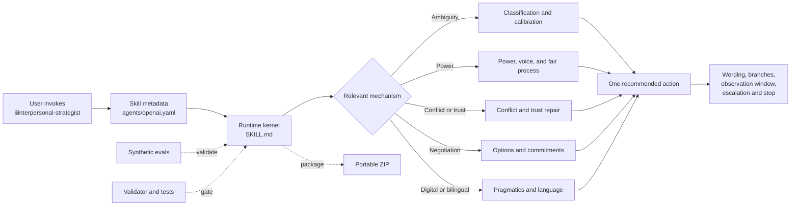

# Interpersonal Strategist

[](https://github.com/haitaowu12/interpersonal-strategist/actions/workflows/ci.yml)
[](LICENSE)
[](CHANGELOG.md)

`interpersonal-strategist` is a standalone, portable Codex agent skill for
workplace and everyday interpersonal decisions. It helps a user distinguish
evidence from interpretation, map power and constraints, compare plausible
explanations, choose a proportionate next move, and prepare language with
response branches and stopping rules.

The project is deliberately more than a prompt collection. It combines a small
runtime kernel with progressively loaded method references, scene playbooks,
evidence constraints, synthetic evaluation fixtures, and deterministic release
tooling.

Current release: **`0.7.0-alpha.2`**

> Alpha means suitable for explicit local evaluation, not behaviorally
> production-ready. Independent bilingual review, fresh holdouts, and a
> controlled private pilot remain promotion gates.

## Project intent

The skill is designed to improve decision quality under interpersonal
uncertainty without pretending to read minds or optimize manipulation.

It supports:

- managing up and down;
- workload, priority, scope, capacity, and refusal;
- credit, visibility, sponsorship, exclusion, and invisible work;
- feedback, accountability, conflict, de-escalation, and trust repair;
- negotiation, alternatives, commitments, and follow-through;
- boundaries, documentation, escalation preparation, and stopping rules;
- ambiguous digital communication and AI-assisted wording;
- non-romantic friend, family, roommate, neighbor, and networking situations;
- English and Simplified Chinese workplace communication.

It does **not** provide:

- romance, dating, intimacy, breakup, or sexual-consent strategy;
- psychological diagnosis or personality scoring;
- coercion, deception, retaliation, surveillance, humiliation, or sabotage;
- substantive legal, HR, medical, safeguarding, crisis, or emergency findings;
- automatic sending, connectors, persistent profiles, or cross-task memory.

The alpha is explicit-only: invoke it with `$interpersonal-strategist`.

## Architecture

The repository separates the portable runtime from development evidence and
release machinery.



### Runtime layer

`skill/interpersonal-strategist/` is the complete distributable skill:

- `SKILL.md` — compact routing, safety, decision loop, output contract, and
  reference-selection rules;
- `agents/openai.yaml` — Codex display metadata and explicit-only policy;
- `references/` — fourteen directly linked knowledge modules;
- `LICENSE`, `NOTICE.md` — redistribution terms.

The runtime is instruction-only and chat-only. It declares no scripts,
connectors, API keys, network dependency, or persistent storage.

### Reasoning pipeline

Every in-scope case follows the same bounded pipeline:

1. **Route** — `IN_SCOPE`, `COACH_WITH_CAUTION`, `REFER_OR_ESCALATE`, or
   `REFUSE`.
2. **Read** — separate records, observations, reports, interpretations, and
   unknowns.
3. **Map** — identify actors, power, dependencies, stakes, exposure, and
   reversibility.
4. **Widen** — compare two to four evidence-linked explanations and the
   observations that would strengthen or weaken them.
5. **Act** — select the smallest useful move using goal fit, information gain,
   reversibility, protection, exposure, escalation risk, and user learning.
6. **Update** — prepare positive, ambiguous, negative, and no-response
   branches; define an observation window, escalation trigger, and stop.

Detailed contracts live in
[`references/method-contracts.md`](skill/interpersonal-strategist/references/method-contracts.md).
They are internal quality controls, not schemas to dump into the user response.

### Progressive disclosure

The kernel loads only the reference relevant to the leading mechanism. The
reference layer currently includes:

- evidence readiness and situation classification;
- power, workplace dynamics, voice, and fair process;
- conflict, de-escalation, trust repair, negotiation, and commitments;
- reciprocity, relationship maintenance, and after-action learning;
- communication controls and twenty end-to-end scene playbooks;
- digital pragmatics, AI-assisted communication, and bilingual adaptation;
- safety, referral, and an evidence-and-claim ledger.

This flat, one-level structure is intentional. It keeps discovery predictable
and avoids loading the entire knowledge base for every case.

## Evidence and safety model

Research supports general mechanisms and contraindications; it does not prove a
specific person's motive or guarantee an intervention outcome.

The [evidence ledger](skill/interpersonal-strategist/references/evidence-ledger.md)
records each promoted source, evidence type, permitted runtime use, and
important limitation. Practitioner frameworks such as SBI, NVC, Radical
Candor, Getting to Yes, and Thomas-Kilmann are quarantined as optional
mnemonics rather than represented as scientific authorities.

Core invariants include:

- no unsupported motive or deception verdict;
- no legal, HR, medical, or diagnostic conclusion;
- no public confrontation by default under power asymmetry;
- no recommendation without a stopping condition;
- no bilingual version that weakens a refusal, boundary, decision right, or
  degree of uncertainty;
- no persistence of third-party personality or vulnerability profiles.

See [SECURITY.md](SECURITY.md) for the runtime trust boundary and responsible
reporting guidance.

## Repository layout

```text
skill/interpersonal-strategist/  directly installable skill
evals/                           synthetic routing, behavior, and parity fixtures
scripts/                         validation, deterministic packaging, install smoke
tests/                           repository and release-contract tests
provenance/                      lineage, source identity, and clean-room boundary
research/                        retained R&D and source-assessment records
external-feedback/               saved and classified advisory reviews
dist/                            ignored, reproducible local release artifacts
```

Development research and external reviews are retained for auditability but
are excluded from the distributable ZIP.

## Install

Codex discovers user skills under `$HOME/.agents/skills` and repository skills
under `.agents/skills`.

User-wide installation:

```bash
mkdir -p "$HOME/.agents/skills"
cp -R skill/interpersonal-strategist "$HOME/.agents/skills/"
```

Repository-scoped installation:

```bash
mkdir -p .agents/skills
cp -R /path/to/interpersonal-strategist/skill/interpersonal-strategist \
  .agents/skills/
```

Restart Codex if a newly installed skill does not appear, then invoke:

```text
$interpersonal-strategist
```

## Develop and verify

Requirements: Python 3.11 or newer; no third-party Python dependencies.

```bash
python3 scripts/validate.py
python3 -m unittest discover -s tests -v
python3 scripts/smoke_install.py
```

The current development suite contains:

- 36 synthetic behavior cases;
- 18 routing cases;
- English–Simplified Chinese parity fixtures;
- a 100-point rubric with five hard-failure classes;
- regression checks for all nine method contracts, twenty scene playbooks,
  promoted evidence identities, package portability, and eval integrity.

These fixtures are development evidence, not untouched qualification holdouts.
See [evals/README.md](evals/README.md) for the evaluation protocol.

## Build a deterministic release

```bash
python3 scripts/package.py
python3 scripts/smoke_install.py \
  --archive dist/interpersonal-strategist-0.7.0-alpha.2.zip
cd dist
shasum -a 256 -c interpersonal-strategist-0.7.0-alpha.2.zip.sha256
```

Packaging creates:

```text
dist/interpersonal-strategist-0.7.0-alpha.2.zip
dist/interpersonal-strategist-0.7.0-alpha.2.zip.sha256
dist/interpersonal-strategist-0.7.0-alpha.2.manifest.json
```

The ZIP contains one directly installable `interpersonal-strategist/`
directory. File ordering, timestamps, modes, and manifest generation are fixed
so identical source produces identical bytes.

## Version and provenance

This is a new standalone lineage beginning at `0.6.0-alpha.1`. It does not
claim source, byte, or behavioral equivalence to the unavailable historical
`v0.5a` candidate.

The implementation was reconstructed from a verified clean-room v0.2 seed and
subsequently developed through locally checked research and advisory reviews.
Exact identities and exclusions are recorded in
[provenance/PROVENANCE.md](provenance/PROVENANCE.md) and
[provenance/SOURCE_MANIFEST.json](provenance/SOURCE_MANIFEST.json).

## Current maturity and roadmap

`0.7.0-alpha.2` has deterministic structural and packaging evidence. It does
not yet have enough independent behavioral evidence for a production claim.

Promotion priorities:

1. independent English–Simplified Chinese functional review;
2. independently authored, untouched holdout cases;
3. calibrated comparative behavioral evaluation against a no-skill baseline;
4. controlled 10–20 episode private pilot with outcome-independent review;
5. stronger accessibility and multilingual adapters without cultural
   stereotyping;
6. source-identity/link checking and a documented release checklist.

## Contributing

Contributions should improve a demonstrated runtime behavior, close a concrete
evaluation gap, or strengthen evidence and safety governance.

Before opening a change:

1. keep real conversations and identifying details out of the repository;
2. add or update a synthetic case that exposes the intended behavior;
3. link new research claims to a stable source identity and state the permitted
   use and limitation;
4. preserve the explicit-only, stateless, chat-only, non-manipulative boundary;
5. run the full verification commands above.

Small, independently reviewable changes are preferred. See
[CHANGELOG.md](CHANGELOG.md) for release history.

## License

MIT. See [LICENSE](LICENSE). Third-party sources remain subject to their own
terms; the repository redistributes original skill content, not source papers
or proprietary practitioner materials.
